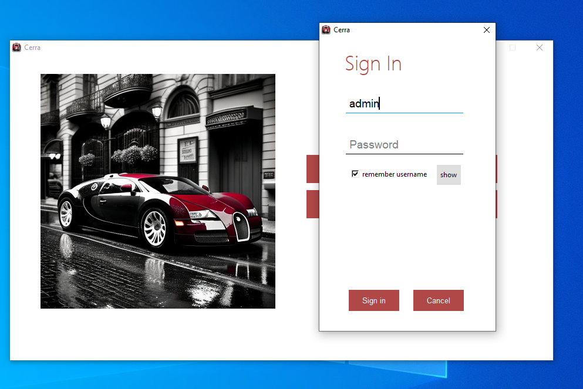
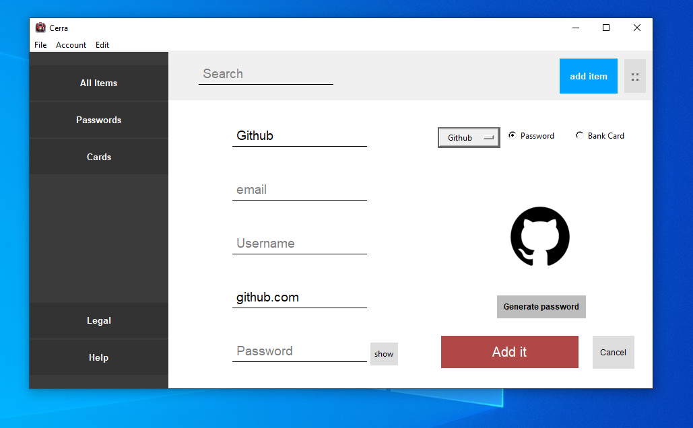
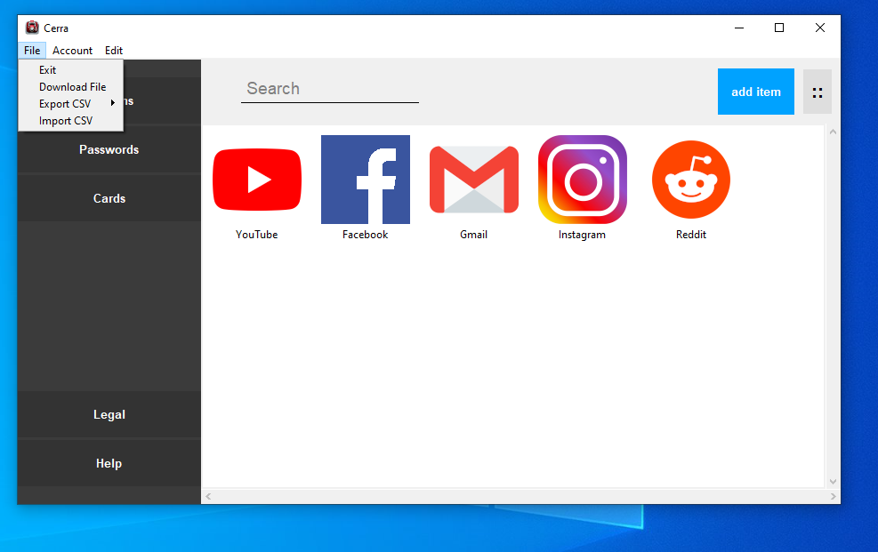

Cerra
================

Cerra is a Python application that securely stores all your passwords or other information in an encrypted format. It uses the SHA-256 encryption algorithm to keep your passwords safe.

Installation
------------

1.  Clone the repository: `git clone -b Modern https://github.com/ffmech/Cerra.git`
2.  Install the required packages: `pip install -r requirements.txt`
3.  Run the program: `python Cerra.py`

Usage
-----

Cerra allows you to store, retrieve, delete and share your passwords or sensitive information in a secure way. Here's how you can use it:

### Adding a password

To add a password, run the program enter your master password and select "Add item" from the menu. Enter the fields you'd like to save of the item, like the username and password. The password will be encrypted and stored securely.

### Retrieving a password

To retrieve a password, run the program and click on an item from the list. The item and its information, such as the password, can be displayed on the screen or copied to your clipboard.

### Deleting a password

To delete a password, run the program click on an item and select "Delete Password" from the bottom. The password will be deleted from the password file. To edit the password click on the edit button and change the information you want.

### Connecting to a Google sheets database

Download service account and Oauth keys for Gmail and google sheets API from the google console cloud. Name them `secret.json` and `email_secret.json` respectively, paste them in the same folder as the program. Name a spreadsheet normal in your sheets and add the usernames you want to the top of the spreadsheet. You can then login.

### Sharing passwords

You can set an inheritor to your passwords that can request the passwords and will receive them in 30 days if you don't deny his request on time. Just click on account in the top menu and click on inheritance to bring out the form.

### Creating and importing files

To create files just click on file in the top menu. Then hover click on Download file which will put a zip file in your download folder you can then unzip this file in the folder with the program to replace the salt and password files. Another way to create files is by creating csv files which can be the full information or just what is needed to upload them to Chrome. To import a csv put the csv file you want to upload in the same folder as the program, rename it to `Passwords.csv` and click on the corresponding menu option in the top menu. You can then import your passwords from Google Chrome.

Security
--------

The Password Manager uses the SHA-256 encryption algorithm to securely store your passwords in the `normal.bin` file or on a Google sheets database. The encryption key is derived from your master password, which is not stored in the program. This means that if you forget your master password, you will not be able to retrieve your passwords.
